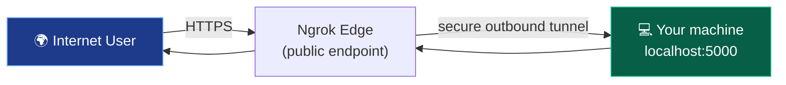

# 🌐 Exposing a Local App with Ngrok

> A secure outbound tunnel that puts a `localhost` app on the public internet — with no firewall or router changes.


---

## 🎯 Objective

Expose a locally running Node.js application to the public internet through Ngrok, understand the tunneling mechanism, and apply secure handling of the authentication token.

## 🧰 Tools

- Ubuntu Desktop
- A Node.js application
- An Ngrok account + auth token
- Internet connection

---

## 🪜 Deployment, Step by Step

### 1. Get the application
```bash
gh repo clone <user>/Module-3-deployment
cd Module-3-deployment
```

### 2. Install Ngrok and authenticate
```bash
snap install ngrok
ngrok config add-authtoken <YOUR_TOKEN>   # treat this token like a password
```

### 3. Run the app locally
```bash
npm install
npm start            # app starts on a local port (e.g. 5000)
```

### 4. Open the tunnel
```bash
ngrok http 5000
```
Ngrok prints a public **HTTPS** URL that forwards to your local app, plus a live session status screen.

---

## ⚙️ How It Works



The tunnel is established **outbound from your machine**, so NAT and firewalls — which allow outbound connections by default — let it through. No port forwarding, no inbound firewall rule.

**Bonus:** Ngrok's local inspector at `http://127.0.0.1:4040` shows every request (method, path, status, headers) in real time — ideal for debugging webhooks.

---

## 📚 What I Learnt

- **Tunneling vs. hosting.** Ngrok is the fast bridge from "works on my machine" to "shareable," not a production host.
- **NAT traversal made practical** — the same networking concept I know from security, applied to app development.
- **Request inspection** turns webhook debugging from guesswork into observation.

---

## 🛡️ Security Strengths

- HTTPS by default — traffic between user and Ngrok edge is encrypted.
- No inbound firewall holes or router changes required.
- Optional basic auth and IP restrictions: `ngrok http 5000 --basic-auth "user:pass"`.

## ⚠️ Security Weaknesses & Cautions

- **The auth token is a credential** — never expose it; fully redact it from screenshots; rotate if leaked.
- **Anyone with the URL can reach your app.** Don't tunnel sensitive or unauthenticated apps without basic auth.
- **It bypasses your firewall by design** — only run it when needed and close the tunnel when done.
- **Traffic transits a third party** (Ngrok's servers) — fine for dev/demos, not for regulated data.

---

## ✅ Outcome

A locally hosted Node.js app reachable on a public HTTPS URL, with the auth token handled securely and the tunnel's traffic observable through the inspector.
